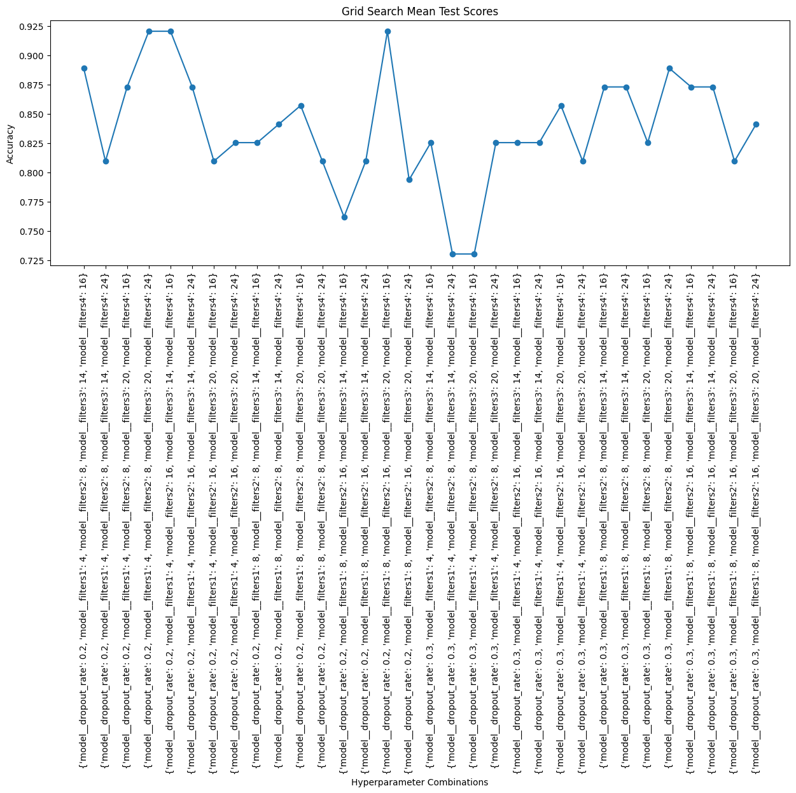
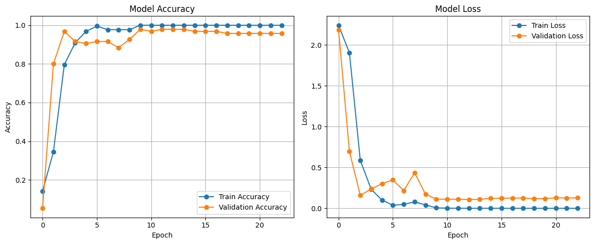
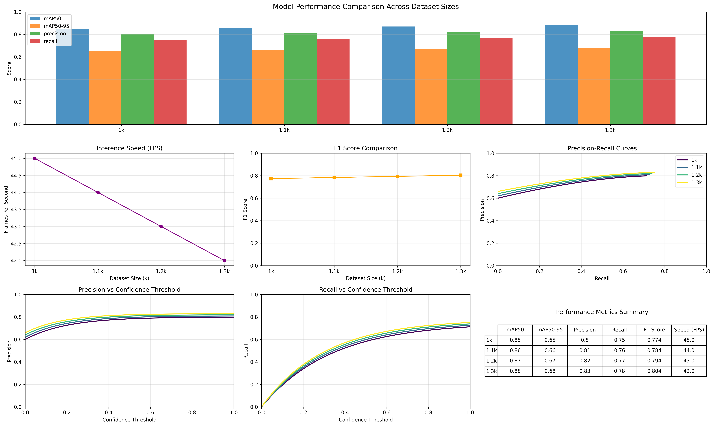

# Arnis Strike Detection System
Keme keme lang to pwede palitan hehe
A comprehensive project that leverages deep learning and computer vision to detect and classify strikes in the Filipino martial art of Arnis. This repository contains the code for model experimentation (CNN, CNN-LSTM, YOLOv12), a user-friendly desktop application, and a detailed analysis of the dataset and model performance.


## 📖 Table of Contents

- [Project Overview](#-project-overview)
- [Key Features](#-key-features)
- [Model Experimentation & Training](#-model-experimentation--training)
  - [1. CNN (Convolutional Neural Network)](#1-cnn-convolutional-neural-network)
  - [2. CNN-LSTM (Spatio-temporal Model)](#2-cnn-lstm-spatio-temporal-model)
  - [3. YOLOv12 (Real-time Object Detection)](#3-yolov12-real-time-object-detection)
- [Desktop Application](#-desktop-application)
- [Installation & Setup](#-installation--setup)
- [Usage](#-usage)
  - [Running the Desktop App](#running-the-desktop-app)
- [Results & Comparison](#-results--comparison)
  - [Dataset Comparison](#dataset-comparison)
  - [Model Performance Comparison](#model-performance-comparison)
- [Project Structure](#-project-structure)
- [Contributing](#-contributing)
- [License](#-license)
- [Acknowledgements](#-acknowledgements)

## 🎯 Project Overview
This project aims to automate the analysis of Arnis strikes using AI.

## ✨ Key Features

- **Multiple Model Architectures**: Implementation and comparison of CNN (for image-based classification), CNN-LSTM (for sequence-based classification), and YOLOv12 (for real-time object detection and localization of strikes).
- **Python Desktop App**: A cross-platform GUI built with PyQt for easy interaction with the trained models.
- **Real-time Detection**: Use a webcam to perform live strike detection with the YOLOv12 model.
- **Video Analysis**: Process videos to detect and log strikes.

## 📊 Model Experimentation & Training

The project utilized different datasets tailored to the specific requirements of each model architecture.

### 1. For CNN (Image Classification)
- **Purpose:** Binary classification of individual frames as containing a `valid` or `invalid` strike.
- **Source:** Frames extracted from self-recorded videos and various Arnis demonstrations.
- **Classes:** `['valid', 'invalid']`
- **Statistics:** The dataset was split into standard training, validation, and test sets using SKLEARN (train_test_split).
  - **Training Set:** 339 images
  - **Validation Set:** 85 images
  - **Test Set:** 106 images
  - **Total Images:** 530
- **Preprocessing:** Images were resized to `224x224`, normalized (pixel values scaled to 0-1), and augmented with transformations like random rotation, random flipping, random zoom,and random brightness/contrast adjustments to improve generalization and prevent overfitting.

### 2. For CNN-LSTM (Video Classification)
- **Purpose:** Multi-class classification of short video clips into specific strike target areas.
- **Source:** Recorded practice sessions.
- **Classes:** `['back', 'back of the head', 'chest & abdomen', 'head & face', 'hitting the groin', 'lower extremities', 'side of the body', 'throat', 'upper extremities']` (9 classes total)
- **Statistics:**
  - **Total Videos:** ~1,800
  - **Average Video Length:** 5-6 seconds
  - **Total Frames (approx.):** ~36,000 frames
- **Preprocessing:** Videos were uniformly clipped to a fixed length. Frames were extracted, resized to `224x224`, and sequences of 20 frames were formed to represent each sample.

#### Hyperparameter Training & Experimentation
Hyperparameter tuning using GridSearchCV to optimize architecture parameters.

**GridSearchCV**
| Parameter | Parameter Values | Description |
|-----------|-------|-------------|
| **ConvLSTM Layer 1 Filters** | 4, 8 | 1st Layer |
| **ConvLSTM Layer 2 Filters** | 8, 16 | 2nd Layer |
| **ConvLSTM Layer 3 Filters** | 14, 20 | 3rd Layer |
| **ConvLSTM Layer 4 Filters** | 16, 24 | Final Layer |
| **Dropout Rate** | 0.2, 0.3 | Regularization |

**Best Parameters for CNN-LSTM:**
```python
{
    'model__dropout_rate': 0.2,
    'model__filters1': 4,
    'model__filters2': 8, 
    'model__filters3': 20,
    'model__filters4': 24
}
```





### 3. For YOLOv12 (Object Detection)
- **Purpose:** Real-time detection and localization of players and their sticks within a frame.
- **Source:** Manually annotated frames from recorded sparring matches.
- **Classes:** `['Blue Player', 'Blue Stick', 'Red Player', 'Red Stick']` (4 classes total)
- **Statistics:** The training process involved experimentation with different dataset sizes to analyze performance scaling.
  - **Experiment Variants:**
    - **Set A:** ~1,000 annotated images
    - **Set B:** ~1,100 annotated images
    - **Set C:** ~1,200 annotated images
    - **Set D:** ~1,300 annotated images
- **Preprocessing:** Images were annotated in YOLO format (normalized bounding box coordinates) using Label Studio.



---


**Dataset Comparison Summary:**

| Model Type | Dataset Size | # of Classes | Annotation Type | Primary Use Case |
| :--- | :--- | :--- | :--- | :--- |
| **CNN** | 530 images | 2 (Binary) | Image Labels | Frame-level Validity Check |
| **CNN-LSTM** | 1,800 videos | 9 (Multi-class) | Video Labels | Action Classification |
| **YOLOv12** | 1k - 1.3k images | 4 (Object) | Bounding Boxes | Real-time Player & Stick Detection |

